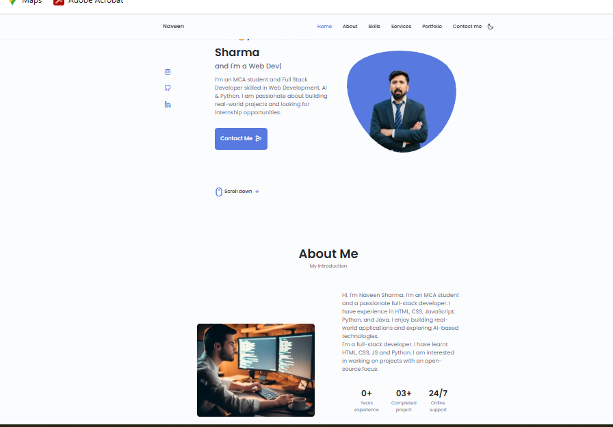

# 🌐 Personal Portfolio Website

Hi 👋, I'm Naveen Sharma  
An MCA student passionate about Web Development and Software Development.

---

## 🚀 About This Project
This is my personal portfolio website where I showcase my skills, projects, and contact details.

---

## 💻 Tech Stack
- HTML
- CSS
- JavaScript
- Bootstrap

---

## 🎯 Features
- Responsive Design (Mobile Friendly)
- Smooth Animations
- Portfolio Projects Section
- Contact Form
- Clean UI/UX

---

## 📂 Projects Included
- Pharmacy Management System (Java + MySQL)
- AI Smart Surveillance System (Python + YOLO)
- Personal Portfolio Website

---

## 🔗 Live Demo
👉 (Add your live link here later)

---

## 📸 Preview

---

## 📞 Contact Me
- Email: naveensharmaaurangabad@gmail.com
- GitHub: https://github.com/Naveen8544
- LinkedIn: https://www.linkedin.com/in/naveen5212

---

## 🙌 Thank You
If you like this project, feel free to ⭐ star the repository.
